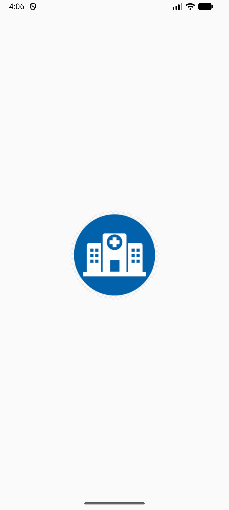
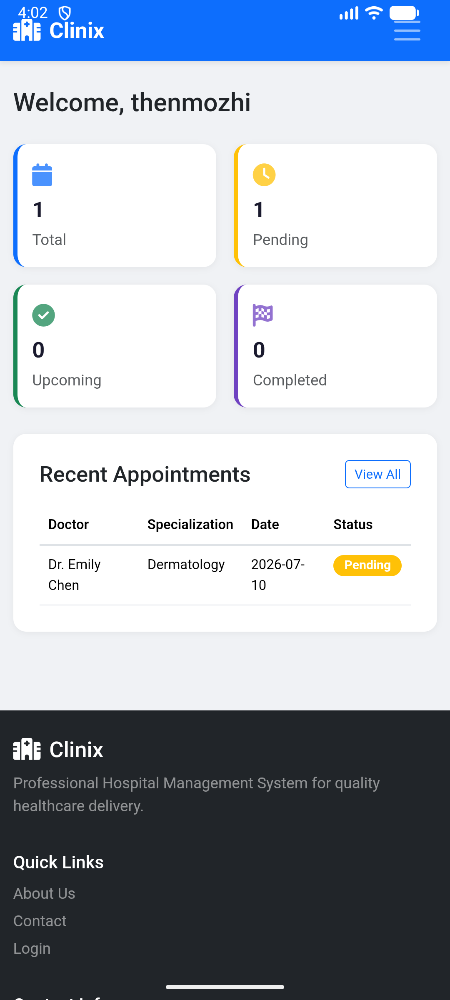
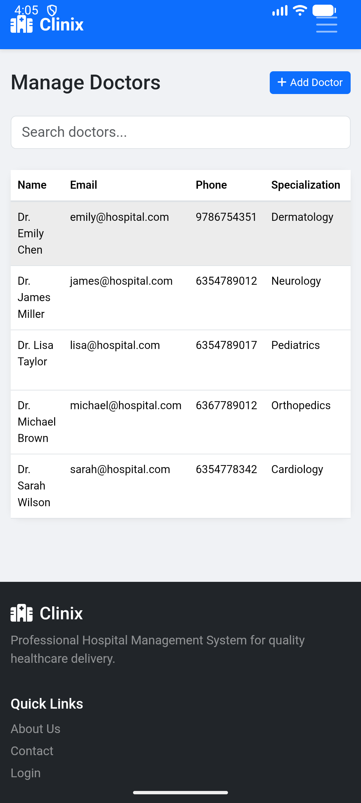
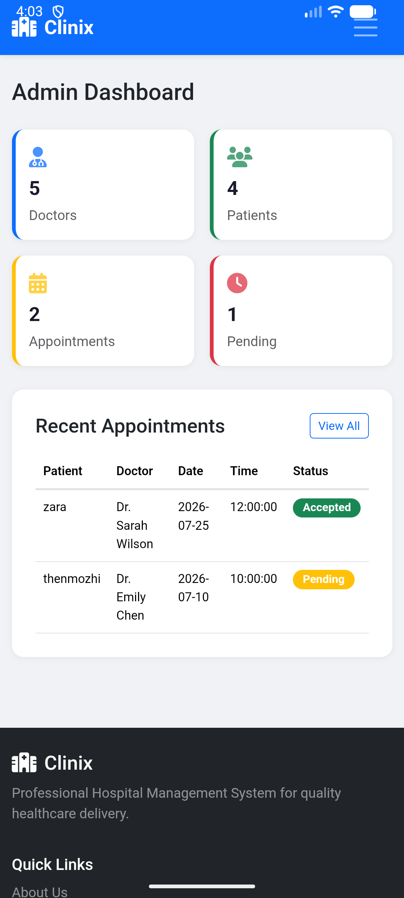
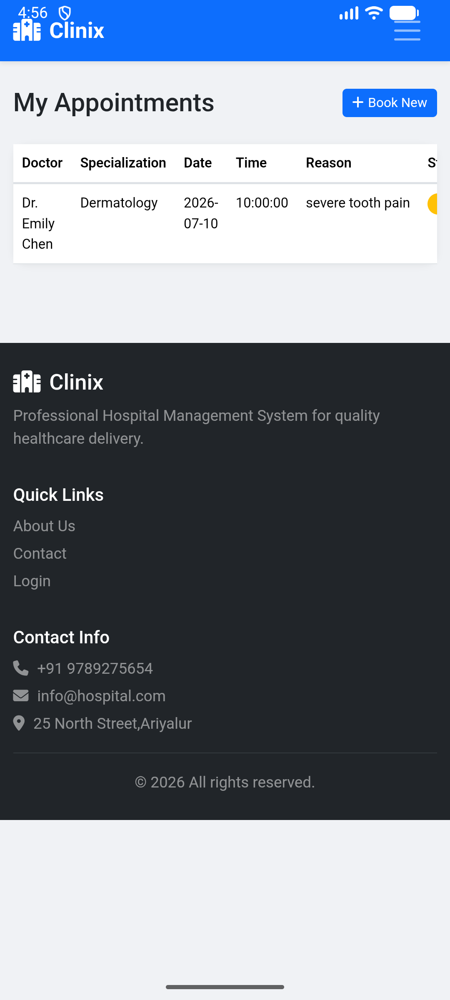

# 🏥 Clinix
### Hospital Management System

[](https://www.php.net/)
[](https://www.mysql.com/)
[](https://getbootstrap.com/)
[](https://developer.android.com/)

A full-stack Hospital Management System featuring a responsive web portal and a native Android WebView application. Built with a focus on secure session management, database integrity, and mobile-first design.

## 📸 Application Screenshots

| Mobile Splash Screen | Patient Dashboard | Doctor Management |
|:---:|:---:|:---:|
|  |  |  |

| Admin Dashboard | Appointment Booking |
|:---:|:---:|
|  |  |

---

## ✨ Key Features

### 🔐 Security & Architecture
*   **Role-Based Access Control (RBAC):** Secure session-based authentication separating Admin, Doctor, and Patient logic.
*   **SQL Injection Prevention:** Extensive use of MySQLi Prepared Statements for all database mutations.
*   **XSS Protection:** Output encoding using `htmlspecialchars()` to prevent cross-site scripting.
*   **Secure Password Storage:** Implemented using Bcrypt via PHP's `password_hash()` and `password_verify()`.

### 🩺 Core Functionality
*   **Appointment Lifecycle Engine:** Full state machine handling (Pending → Accepted/Rejected → Completed/Cancelled) with duplicate booking prevention.
*   **Dynamic Search & Filtering:** Real-time filtering of doctors by specialization and appointment records by status.
*   **Database Integrity:** Foreign key constraints with `ON DELETE CASCADE` to prevent orphaned data.

### 📱 Mobile Application
*   **Native Android Wrapper:** Java-based WebView application with a custom Splash Screen.
*   **Cross-Session Compatibility:** Resolved PHP session issues in WebView by explicitly configuring `CookieManager` and DOM Storage.

---

## 🛠 Tech Stack

| Category | Technologies Used |
| :--- | :--- |
| **Frontend** | HTML5, CSS3, JavaScript, Bootstrap 5 |
| **Backend** | PHP 8 (Procedural), MySQLi |
| **Database** | MySQL (MariaDB), phpMyAdmin |
| **Mobile** | Android (Java), WebView, Material Components |
| **Environment** | XAMPP (Apache), Android Studio, Git |

---

## 📁 Project Structure

```text
├── web-backend/
│   └── hospital/
│       ├── config.php          # DB connection, auth helpers, flash messages
│       ├── includes/           # Reusable header.php & footer.php
│       ├── admin/              # Dashboard, Doctor CRUD, Patient/Appointment views
│       ├── doctor/             # Dashboard, Accept/Reject/Complete logic
│       ├── patient/            # Dashboard, Search, Booking, History
│       ├── database/
│       │   └── db.sql          # Schema, Foreign Keys, Seed Data
│       ├── css/style.css       # Custom variables, mobile tweaks
│       └── js/app.js           # Confirm dialogs, auto-dismiss alerts
│
└── android-app/
    └── app/src/main/
        ├── java/.../           # SplashActivity.java, MainActivity.java
        └── res/layout/         # activity_splash.xml, activity_main.xml
```

---

## 🚀 Local Setup & Installation

### Prerequisites
*   [XAMPP](https://www.apachefriends.org/) (Includes Apache, PHP, MySQL)
*   [Android Studio](https://developer.android.com/studio)

### 1. Web Backend Setup
1. Clone this repository to your local machine.
2. Copy the `web-backend/hospital` folder into your XAMPP `htdocs` directory (e.g., `C:\xampp\htdocs\hospital`).
3. Start **Apache** and **MySQL** from the XAMPP Control Panel.
4. Open `http://localhost/phpmyadmin`, go to the **Import** tab, and select `web-backend/hospital/database/db.sql`.
5. Open `web-backend/hospital/config.php` and update the database credentials if necessary.
6. Access the system at: `http://localhost/hospital/`

> **Default Admin Login:** `admin` / `password`

### 2. Android App Setup
1. Open the `android-app` folder in Android Studio.
2. Wait for Gradle sync to finish.
3. Ensure XAMPP is running on your computer.
4. **For Emulator:** The URL in `MainActivity.java` is set to `http://10.0.2.2/hospital/` (maps to localhost).
5. **For Real Device:** Change the URL to your computer's LAN IP (e.g., `http://192.168.1.x/hospital/`).
6. Run the app on an emulator or connected device.


## 👤 Author

B.BHAVADHARANI  
[](https://www.linkedin.com/in/bhavadharani25/)
